# inretensys-backend

## What is it?
A python backend script to configure oemof-energysystems from a web interface via an api.
The calculation of the energysystem is possible with an short python-script to build the real oemof-objects and calaculate the model at an high performance center.

Bachlorthesis from Andreas Lubojanski at the University of Applied Science Nordhausen.

Help for future docs:
For full documentation visit [mkdocs.org](https://www.mkdocs.org).

## Project layout
The system is configured by a webinterface and these file is dumped to an binary file with all params.
These file is given to an Modelbuilder (see [Modelbuilder](common/modelbuilder.md)) and builds the oemof-objects with the given arguments.
After this step the model is optimised and calculated. 
All results are stored with the model in a given file.

### Ablauf und Aufteilung

```mermaid
sequenceDiagram
  autonumber
  Nutzer->>Webinterface: Erzeugung der Struktur <br> Eingabe des Parametrisierung
  Webinterface->>Nutzer: Ensys-Energysystem als binäre Datei
  Nutzer->>Rechenzentrum: HPC-Parameter <br> Ensys-Konfigurationsdatei
  Rechenzentrum->>Rechenzentrum: Erstellung, Optimierung und <br> Berechnung des Energysystem <br> aus der Konfigurationsdatei
  Rechenzentrum->>Nutzer: Information, die Daten bearbeitet wurden
  Nutzer->>Nutzer: Erstellung der Ausgabe <br> Plots, Datenslices etc.
```

